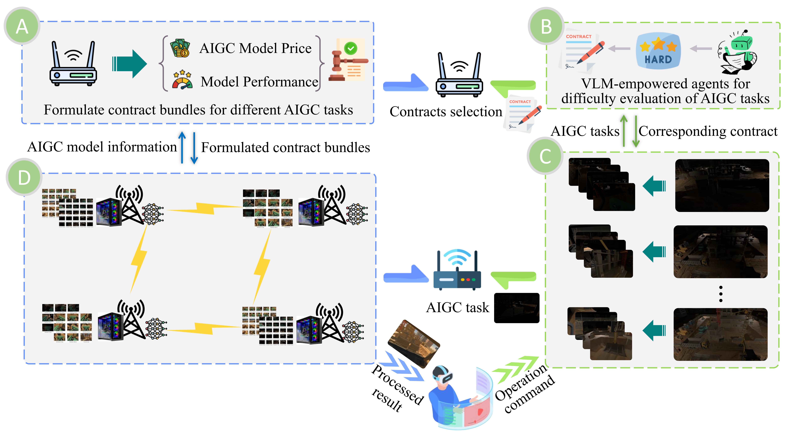

# Vision-Language-Model-Empowered-Contract-Theory-for-AIGC-Task-Allocation-in-Teleoperation

The framework of our paper is presented as

## Diffusion-based AIGC model

> The function of the folder “**Diffusion-Based-AIGC Tasks**” is to train Diffusion-based AIGC model with varying-sized paired datasets.
>
> This one is refer to the repository of “https://github.com/JianghaiSCU/Diffusion-Low-Light”
>
> ### Dataset
>
> >  In this repository, the paired datasets including **large** and **small** datasets. 
>
> These two dataset is stored in the file path of “Diffusion-Based-AIGC Tasks\data\Image_restoration\LL_dataset\Construction\train”.

## Contract Theory-Assisted AIGC Task Allocation

> 1. The function for AIGC task allocation is in the folder of “**lvm_contractThoery_allocation**”.
>
> 2. The AIGC tasks are sampled from the folder of “**lvm_contractThoery_allocation\Images_pool**”
> 3. The function of contract theory is depicted in the file of “**lvm_contractThoery_allocation\contractTheory.py**”
> 4. The comparison code is presented in the file of “**lvm_contractThoery_allocation\comparison.py**”
